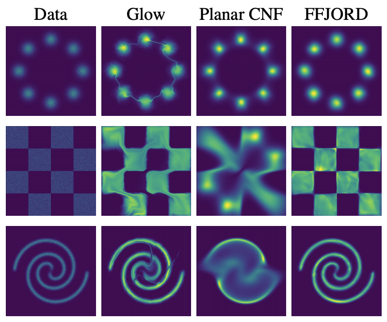
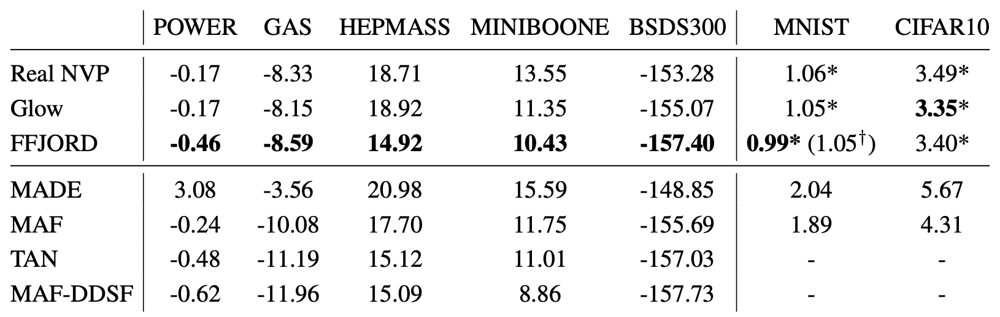
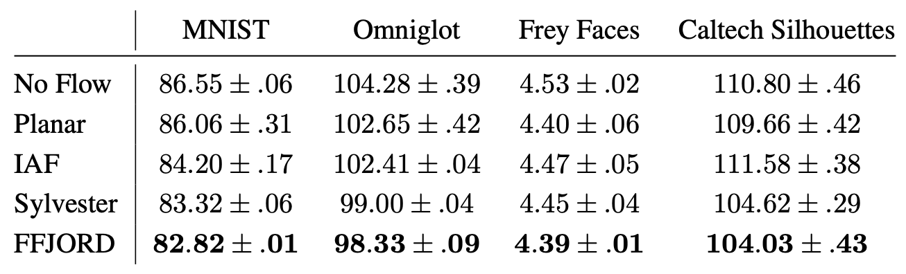

# Normalizing flow implementations and benchmarks

<!-- ## 📦 Packages

  -->

## PyTorch Packages

1. [`FrEIA`](https://github.com/VLL-HD/FrEIA) by [VLL Heidelberg](https://hci.iwr.uni-heidelberg.de/vislearn) 

    > The Framework for Easily Invertible Architectures (FrEIA) is based on RNVP flows. Easy to setup, it allows to define complex Invertible Neural Networks (INNs) from simple invertible building blocks.

    > [Density estimation using Real NVP](https://arxiv.org/abs/1605.08803) by Laurent Dinh, Jascha Sohl-Dickstein, Samy Bengio.

2. [`nflows`](https://github.com/bayesiains/nflows) by [Bayesiains](https://homepages.inf.ed.ac.uk/imurray2/group) 

    > A suite of most of the SOTA methods using PyTorch. From an ML group in Edinburgh. They created the current SOTA spline flows. Almost as complete as you'll find from a single repo.

    > [Neural Spline Flows](https://arxiv.org/abs/1906.04032) by Conor Durkan et. al.

3. ['SNF'](https://github.com/noegroup/stochastic_normalizing_flows) by [Frank Noe's group](http://www.mi.fu-berlin.de/en/math/groups/ai4s)  

    > They introduce sochasticity in Boltzmann-generating flows. The key methodological advance is that we avoid to compute p(x) point-wise, which would require an intractable integration over all paths mapping to the same x, and show how both training of the flow and reweighting of p(x) to exp(-u(x)) can be done via path sampling and without requiring p(x) explicitly. Part of implementation is built based on the nflows.

    > [Stochastic Normalizing Flows](https://arxiv.org/abs/2002.06707) by Hao Wu, Jonas Köhler, Frank Noé.

  4. ['Manifold-flow'](https://github.com/johannbrehmer/manifold-flow) by [Kyle Cranmer](http://theoryandpractice.org/) 

      > In the paper Flows for simultaneous manifold learning and density estimation we introduce manifold-learning flows or ℳ-flows, a new class of generative models that simultaneously learn the data manifold as well as a tractable probability density on that manifold. This repository contains our implementation of ℳ-flows, as well as the code for our experiments with them.

      > [Flows for simultaneous manifold learning and density estimation](https://arxiv.org/abs/2003.13913) by Brehmer & Cranmer.

 

## Benchmark problems

### Density estimation

1. Density estimation on Toy 2D data

Follow instructions from https://github.com/rtqichen/ffjord

2. Density estimation on real data (tabular)

Follow instructions from https://github.com/gpapamak/maf and place them in data/

### Variational inference

1. Variational Autoencoder on four datasets

Follow instructions from https://github.com/riannevdberg/sylvester-flows and place them in data/.

### Image generation

Follow instructions from https://github.com/bayesiains/nflows and place them in data/

**References**

1. Will Grathwohl, Ricky TQ Chen, Jesse Bettencourt, Ilya Sutskever, and David Duvenaud. "FFJORD: Free-Form Continuous Dynamics for Scalable Reversible Generative Models." In International Conference on Learning Representations. 2018.

2. Rianne Van Den Berg, Leonard Hasenclever, Jakub M. Tomczak, and Max Welling. "Sylvester normalizing flows for variational inference." In 34th Conference on Uncertainty in Artificial Intelligence 2018, UAI 2018, pp. 393-402. Association For Uncertainty in Artificial Intelligence (AUAI), 2018.
